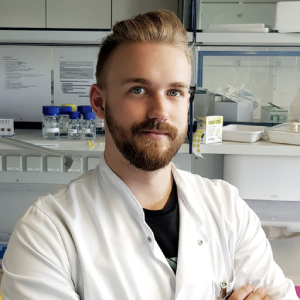

 

## Info

{: align=right }
Mike Marquet is a postDoc at the *Institute for Infectious Diseases and Infection Control*. His area of expertise is metagenomes, phages, workflows, containerization and nanopore sequencing. 

## Projects

**Enhancing hospital surveillance through methylation-guided plasmid-host pairing for multidrug-resistant bacteria**:
The project aims to develop and evaluate methylation-based approaches for tracking antimicrobial resistance plasmids in clinical settings through three key objectives:  
(1) assess the stability of DNA methylation patterns in clinical bacterial isolates under antibiotic pressure and the temporal dynamics and host specificity of methylation signatures during bacterial growth (methylation stress memory) and plasmid conjugation events,
(2) validate the feasibility of methylation-based plasmid-host linking in complex clinical specimens, with a focus on stool samples, and 
(3) development and validation of a streamlined, user-friendly bioinformatic workflow for methylation pattern detection and analysis.   

[**PEONS**: ](https://www.uniklinikum-jena.de/infektionsmedizin/Translationale+Forschung/Klinische+Studien/PEONS.html)
Prediction of Early Onset Neonatal Sepsis  

Sequenced metagenomes of clinical maternal and child samples  will be analysed and used to predict whether the infants will develop a sepsis or not. A descriptive longitudinal analysis of the maternal sample is intended to show how antibiosis changes the composition of the vaginal metagenome
The What the Phage workflow will be used to identify the Phageome in the clinical metagenome data.

[**De-Phage**: ](https://www.uniklinikum-jena.de/infektionsmedizin/Translationale+Forschung/Forschungs_+und+Entwicklungsprojekte/De_Phage.html)
De-colonisation via Phages  

A pilot study to estimate the risk of horizontal gene transfer by therapeutic phages from CPE donor strains (containing the most frequent carbapenemases VIM and KPC) to recipient strains. The results may have a high impact on the phage research in this area in regard to whether phages as principle strategy for intestinal CPE de-colonization will be further investigated or abandoned.

## Links
[:octicons-mail-16: Email](mailto:mike.marquet@med.uni-jena.de)  
[:octicons-person-16: Researchgate](https://www.researchgate.net/profile/Mike_Marquet)  
[:octicons-book-16: google scholar](https://scholar.google.com/citations?user=jEV4ddEAAAAJ&hl=en)  
[:octicons-mark-github-16: github link](https://github.com/mult1fractal)

